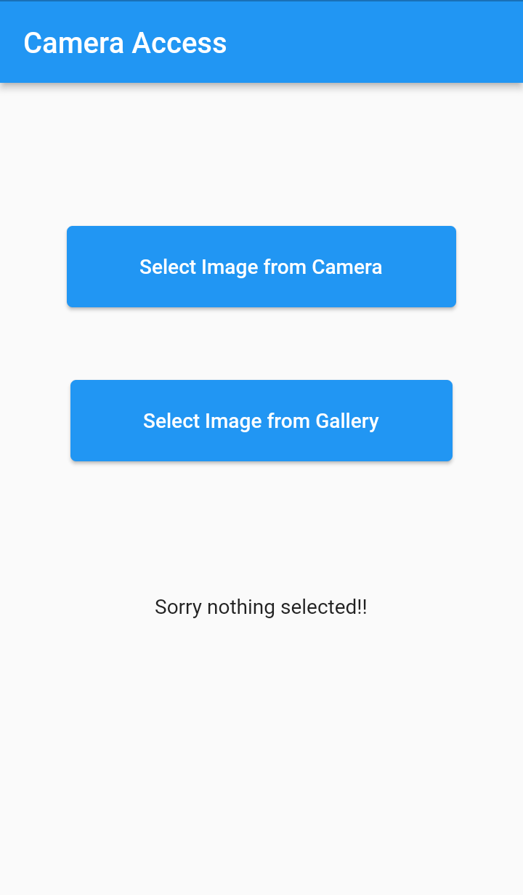

# chapter

Camera and Gallery access using image_picker plugin.

## Screenshot


## Dependancies
image_picker

install using following command
```sh
flutter pub add image_picker
```
## Android Permission in AndroidManifest.xml
    <uses-permission android:name="android.permission.CAMERA" />
    <uses-permission android:name="android.permission.READ_EXTERNAL_STORAGE" />
    <uses-permission android:name="android.permission.WRITE_EXTERNAL_STORAGE" />


## Example
```
import 'dart:io';

import 'package:flutter/material.dart';
import 'package:image_picker/image_picker.dart';

class CameraAccess extends StatefulWidget {
  const CameraAccess({Key? key}) : super(key: key);

  @override
  State<StatefulWidget> createState() {
    return CameraAccessState();
  }
}

class CameraAccessState extends State<CameraAccess> {
  File? imageFile;
  //display image selected from gallery
  selectFromCamera() async {
    XFile? image = await ImagePicker().pickImage(source: ImageSource.camera);
    setState(() {
      imageFile = File(image!.path);
    });
  }

  selectFromGallery() async {
    XFile? image = await ImagePicker().pickImage(source: ImageSource.gallery);
    setState(() {
      imageFile = File(image!.path);
    });
  }

  @override
  Widget build(BuildContext context) {
    return MaterialApp(
        debugShowCheckedModeBanner: false,
        home: Scaffold(
          appBar: AppBar(
            title: const Text("Camera Access"),
          ),
          body: Builder(
            builder: (BuildContext context) {
              return Center(
                child: Column(
                  mainAxisAlignment: MainAxisAlignment.center,
                  children: <Widget>[
                    ElevatedButton(
                        style: ElevatedButton.styleFrom(
                            padding: const EdgeInsets.symmetric(
                                horizontal: 50, vertical: 20)),
                        onPressed: selectFromCamera,
                        child: const Text('Select Image from Camera')),
                    const SizedBox(
                      height: 50,
                    ),
                    ElevatedButton(
                        style: ElevatedButton.styleFrom(
                            padding: const EdgeInsets.symmetric(
                                horizontal: 50, vertical: 20)),
                        onPressed: selectFromGallery,
                        child: const Text('Select Image from Gallery')),
                    SizedBox(
                      height: 200.0,
                      width: 300.0,
                      child: imageFile == null
                          ? const Center(
                              child: Text('Sorry nothing selected!!'))
                          : Center(child: Image.file(imageFile!)),
                    )
                  ],
                ),
              );
            },
          ),
        ));
  }
}
```

This is sample project to access file from camera and gallery.

A few resources to get you started if this is your first Flutter project:

- [Lab: Write your first Flutter app](https://docs.flutter.dev/get-started/codelab)
- [Cookbook: Useful Flutter samples](https://docs.flutter.dev/cookbook)
- [image_picker: pub.dev](https://pub.dev/packages/image_picker)

For help getting started with Flutter development, view the
[online documentation](https://docs.flutter.dev/), which offers tutorials,
samples, guidance on mobile development, and a full API reference.
